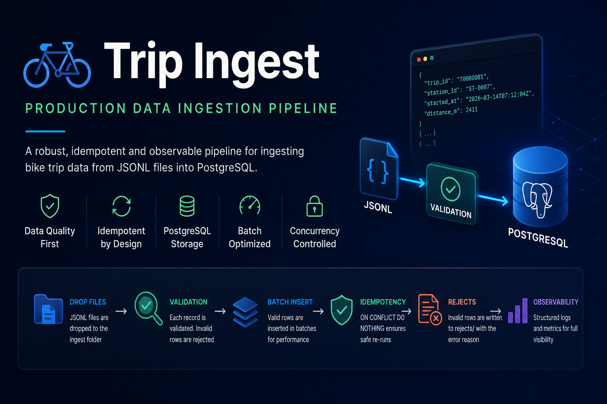
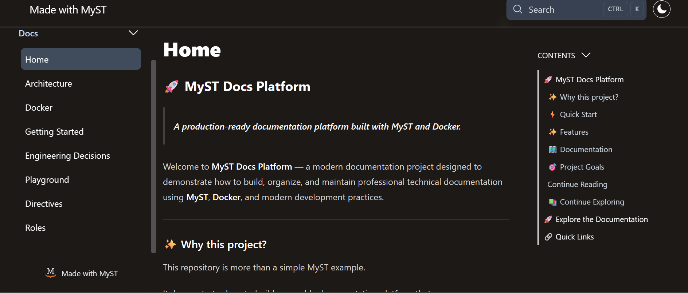

# 👋 Hi, I'm Yonatan Afengar

> **Senior BI Developer with 5+ years of enterprise experience, expanding into modern Data Engineering through production-ready Python projects.**

---

# 👨‍💻 About

Welcome to my engineering portfolio.

I'm a Senior BI Developer with over five years of experience designing and delivering enterprise Business Intelligence and ETL solutions.

Alongside my professional work, I build production-ready Python and Data Engineering projects that emphasize clean architecture, reproducible environments, automated testing, technical documentation, and modern engineering best practices.

This portfolio documents my journey from Enterprise BI toward modern Data Engineering.

---

# 💼 Professional Background

## Enterprise Experience

- Senior BI Developer
- Enterprise ETL Development
- IBM InfoSphere DataStage
- SQL / PL/SQL
- Oracle
- SQL Server
- Data Warehousing
- Backend Data Integration
- Business Intelligence

---

# 🚀 Current Focus

- Python Development
- Data Engineering
- ETL Pipelines
- PostgreSQL
- Docker
- Git
- Apache Airflow
- PySpark

---

# 🛠 Technical Skills

| Category | Technologies |
|-----------|--------------|
| **Programming** | Python |
| **Databases** | PostgreSQL, SQL Server, Oracle |
| **Query Languages** | SQL, T-SQL, PL/SQL |
| **BI & ETL** | IBM InfoSphere DataStage, SSIS, SSAS, Power BI |
| **Engineering** | Docker, Git, Linux, Alembic |
| **Testing** | Pytest, MyPy |
| **Currently Learning** | Apache Airflow, PySpark |

---

# 🚀 Featured Projects

---

## 🚆 Trip Ingest Pipeline

> **Production-style ETL pipeline for ingesting JSONL datasets into PostgreSQL using Python, Docker, Alembic, and automated testing.**

### 🎯 Project Goal

Build a production-ready ETL pipeline capable of validating, processing, and loading large JSONL datasets into PostgreSQL while supporting reproducible development environments, automated testing, and maintainable architecture.

### 🛠 Technologies

- Python 3.12
- PostgreSQL
- Docker
- Docker Compose
- Alembic
- Pytest
- MyPy
- JSONL
- Git

### ⭐ Highlights

- Stream-based ingestion
- Batch ETL processing
- Idempotent loading
- Reject handling
- PostgreSQL integration
- Alembic database migrations
- Dockerized development
- End-to-end testing
- Static type checking with MyPy
- Production-style architecture

### 🔗 Repository

➡️ **https://github.com/YoniAfengar/trip-ingest**

---

## 📚 Developer Documentation Platform

> **Production-ready documentation platform built with MyST Markdown, Docker, Python, and Jupyter Notebooks.**

### 🎯 Project Goal

Develop a modern technical documentation platform demonstrating reproducible environments, executable documentation, version control, and engineering best practices.

### 🛠 Technologies

- Python
- MyST Markdown
- Docker
- Docker Compose
- Git
- Jupyter Notebook

### ⭐ Highlights

- Professional documentation platform
- Interactive notebooks
- Mermaid diagrams
- Cross references
- Dockerized environment
- GitHub Releases
- Production-ready documentation workflow

### 🔗 Repository

➡️ **https://github.com/YoniAfengar/myst-docs-platform**

---

# 🎯 What's Next

The next projects planned for this portfolio include:

- Apache Airflow Orchestration
- PySpark Data Processing
- Cloud Data Engineering (AWS)
- End-to-End Data Platform

---

# 📈 Engineering Philosophy

I believe the best way to learn software engineering is by building real projects.

Each repository in this portfolio focuses on solving practical engineering problems while emphasizing clean architecture, automation, testing, documentation, and maintainability.

My goal is to combine enterprise Business Intelligence experience with modern software engineering practices to build reliable, scalable data platforms.

---

# 📄 Resume

📥 **[Download my Resume](resume/Yonatan_Afengar_Resume.pdf)**

---

# 📬 Contact

- 💻 GitHub: https://github.com/YoniAfengar
- 💼 LinkedIn: https://www.linkedin.com/in/yonatan-afengar-92bb18155/

---

# 💡 Engineering Principles

> Build reliable software.

> Write maintainable code.

> Automate repetitive work.

> Keep learning.

> Deliver value.