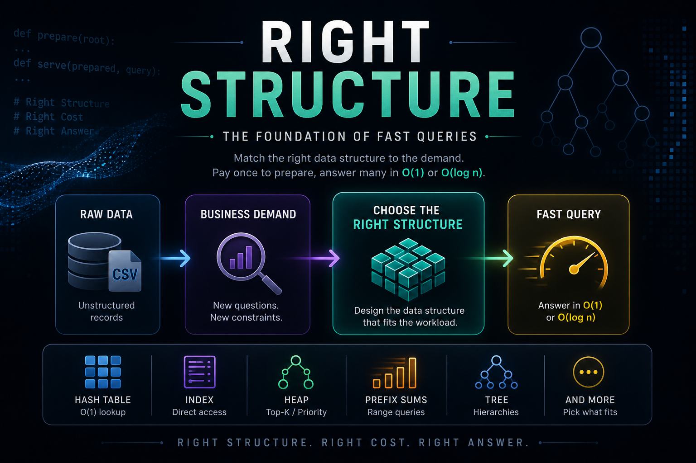
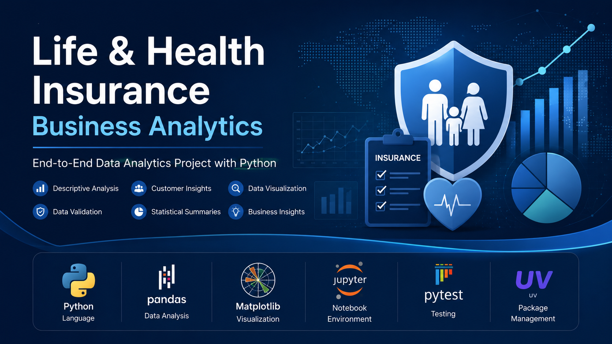
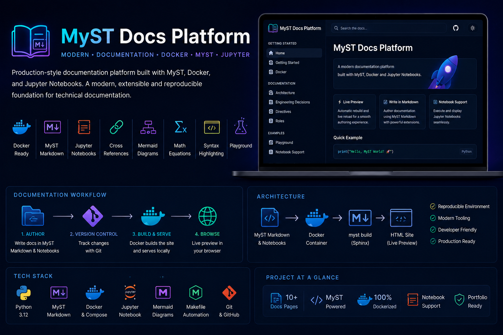

# 👋 Hi, I'm Yonatan Afengar

> **Data Engineer with 5+ years of experience across enterprise BI, ETL, data integration, and data systems — building reliable data solutions with Python, SQL, PostgreSQL, and modern engineering practices.**

---

# 👨‍💻 About

I'm a Data Engineer with over five years of experience across enterprise Business Intelligence, ETL development, data integration, and data warehousing.

My professional background includes building enterprise data solutions with IBM InfoSphere DataStage, SQL, PL/SQL, Oracle, and SQL Server.

Alongside that foundation, I work with modern Data Engineering technologies and practices including Python, PostgreSQL, Docker, automated testing, type safety, reproducible environments, and Git-based development workflows.

This portfolio showcases projects focused on data pipelines, data structures, analytics, and engineering practices — with an emphasis on reliability, maintainability, performance, and clear technical decision-making.

---

# 💼 Professional Background

My experience spans both traditional enterprise data platforms and modern Data Engineering.

- Data Engineering
- Enterprise ETL Development
- IBM InfoSphere DataStage
- SQL / PL/SQL
- Oracle
- SQL Server
- Data Warehousing
- Backend Data Integration
- Business Intelligence

---

# 🚀 Current Focus

- Python
- Data Engineering
- ETL & Data Pipelines
- PostgreSQL
- Docker
- Apache Airflow
- PySpark
- Cloud Data Engineering
- Data Platform Architecture

---

# 🛠 Technical Skills

| Category | Technologies |
|---|---|
| **Programming** | Python |
| **Databases** | PostgreSQL, SQL Server, Oracle |
| **Query Languages** | SQL, T-SQL, PL/SQL |
| **Data Engineering & ETL** | IBM InfoSphere DataStage, SSIS, ETL Pipelines, Data Integration |
| **BI & Analytics** | Power BI, SSAS, Data Warehousing |
| **Engineering** | Docker, Git, Linux, Alembic |
| **Testing & Quality** | Pytest, MyPy, Ruff |
| **Currently Expanding** | Apache Airflow, PySpark, Cloud Data Engineering |

---

# 🚀 Featured Projects

## 🚆 Trip Ingest Pipeline

> **Production-style ETL pipeline for validating, processing, and loading JSONL datasets into PostgreSQL using Python, Docker, Alembic, and automated testing.**

### 🎯 Project Goal

Build a reliable ingestion pipeline capable of processing JSONL datasets, validating individual records, loading valid data into PostgreSQL, isolating rejected records, and supporting safe reruns.

The project focuses on the engineering concerns surrounding a real ingestion workflow rather than only moving data from one place to another.

### 🛠 Technologies

- Python
- PostgreSQL
- Psycopg
- Docker
- Docker Compose
- Alembic
- Pytest
- MyPy
- uv
- Git

### ⭐ Highlights

- JSONL ingestion and validation
- Configurable batch loading
- PostgreSQL persistence
- Idempotent reruns with conflict handling
- Per-record reject isolation
- Automated database migrations
- PostgreSQL-backed concurrency control
- Structured ingestion summaries
- Dockerized development environment
- Automated testing with Pytest
- Strict static type checking with MyPy

### 🔗 Repository

➡️ **https://github.com/YoniAfengar/trip-ingest**

---

## 🧪 Pipeline TDD

> **Test-first PostgreSQL ingestion pipeline focused on reliability, transaction boundaries, integration testing, and mutation-tested behavior.**

### 🎯 Project Goal

Build a dock-event ingestion pipeline entirely through Test-Driven Development, using real PostgreSQL integration tests and production-style database migrations.

The project focuses on proving pipeline behavior under realistic failure conditions — including malformed input, duplicate events, foreign-key violations, transaction rollback, committed writes, and idempotent reruns.

### 🛠 Technologies

- Python
- PostgreSQL
- Psycopg
- Testcontainers
- Docker
- Alembic
- Pytest
- MyPy
- uv
- Git

### ⭐ Highlights

- Strict RED → GREEN → REFACTOR development workflow
- Real PostgreSQL integration tests with Testcontainers
- Real Alembic migrations applied inside the test environment
- Transaction rollback isolation for database tests
- TRUNCATE-based isolation for committed pipeline runs
- Database-enforced foreign-key integrity
- Idempotent loading with `ON CONFLICT DO NOTHING`
- Malformed-row handling without terminating the pipeline
- Mutation testing with 3/3 deliberately broken implementations detected
- Automated source-size gate
- 23 passing tests
- Strict static type checking with MyPy

### 🔗 Repository

➡️ **https://github.com/YoniAfengar/pipeline-tdd**

---

## 🧠 Right Data Structure

> **Workload-driven Python project exploring how changing business requirements force different data-structure decisions and performance trade-offs.**

### 🎯 Project Goal

Design efficient solutions for changing business queries by selecting data structures based on access patterns and explicit computational-cost requirements.

The project demonstrates how the correct representation changes as the workload evolves — and why an efficient solution for one requirement may become the wrong solution for the next.

### 🛠 Technologies

- Python 3.11+
- Pytest
- MyPy
- uv
- Git
- Data Structures
- Algorithms

### ⭐ Highlights

- O(1) station lookups with hash-based indexing
- Multiple access patterns using dedicated indexes
- Top-K selection with a manually implemented Min Heap
- Binary search for time-range boundaries
- Prefix sums for O(1) range aggregation
- Recursive traversal of irregular tree structures
- Operation-count based performance validation
- Strict static type checking with MyPy
- Analysis of read-heavy vs. write-heavy design trade-offs

### 🔗 Repository

➡️ **https://github.com/YoniAfengar/right-structure**

---

## 🏥 Life & Health Insurance Business Analytics

> **Business-oriented exploratory analysis of synthetic life and health insurance claims using Python, pandas, Matplotlib, reusable analytical modules, automated validation, and unit testing.**

### 🎯 Project Goal

Analyze life and health insurance claim data to identify distribution patterns, assess data quality, compare claim severity across customer groups, and produce clear business insights through a reproducible analytics workflow.

### 🛠 Technologies

- Python 3.12+
- pandas
- Matplotlib
- Jupyter Notebook
- Pytest
- Ruff
- uv
- Git

### ⭐ Highlights

- Business-oriented exploratory data analysis
- Automated data validation
- Statistical summaries
- Reusable analytical modules
- Business-focused visualizations
- Unit testing with Pytest
- Code-quality validation with Ruff
- Reproducible dependency management with uv
- Executive summary and documented methodology

### 🔗 Repository

➡️ **https://github.com/YoniAfengar/life-health-insurance-business-analytics**

---

## 📚 Developer Documentation Platform

> **Technical documentation platform built with MyST Markdown, Docker, Python, and Jupyter Notebooks.**

### 🎯 Project Goal

Build a reproducible technical documentation environment supporting executable content, version control, diagrams, notebooks, and containerized development.

### 🛠 Technologies

- Python
- MyST Markdown
- Docker
- Docker Compose
- Git
- Jupyter Notebook

### ⭐ Highlights

- Structured technical documentation
- Interactive notebooks
- Mermaid diagrams
- Cross references
- Dockerized environment
- GitHub Releases
- Reproducible documentation workflow

### 🔗 Repository

➡️ **https://github.com/YoniAfengar/myst-docs-platform**

---

# 🎯 What's Next

The next stage of this portfolio focuses on larger Data Engineering systems:

- Apache Airflow orchestration
- PySpark data processing
- Cloud Data Engineering
- End-to-end data platform development

The goal is to combine these technologies in increasingly complete systems rather than treating them as isolated tools.

---

# 📈 Engineering Philosophy

Good Data Engineering is not only about moving data.

It is about making deliberate decisions around reliability, performance, maintainability, data quality, and operational simplicity.

My approach is to understand the problem first, choose the appropriate architecture and tools, and build systems whose behavior can be tested and explained.

The projects in this portfolio reflect that approach — from ingestion and data modeling to algorithmic trade-offs, analytics, testing, and documentation.

---

# 📄 Resume

📥 **[Download my Resume](resume/Yonatan_Afengar_Resume.pdf)**

---

# 📬 Contact

- 💻 GitHub: https://github.com/YoniAfengar
- 💼 LinkedIn: https://www.linkedin.com/in/yonatan-afengar-92bb18155/

---

# 💡 Engineering Principles

> Build for the workload.

> Make data reliable.

> Test what matters.

> Keep systems understandable.

> Deliver value.